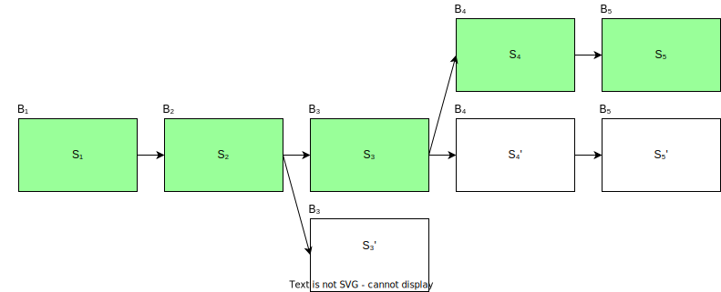
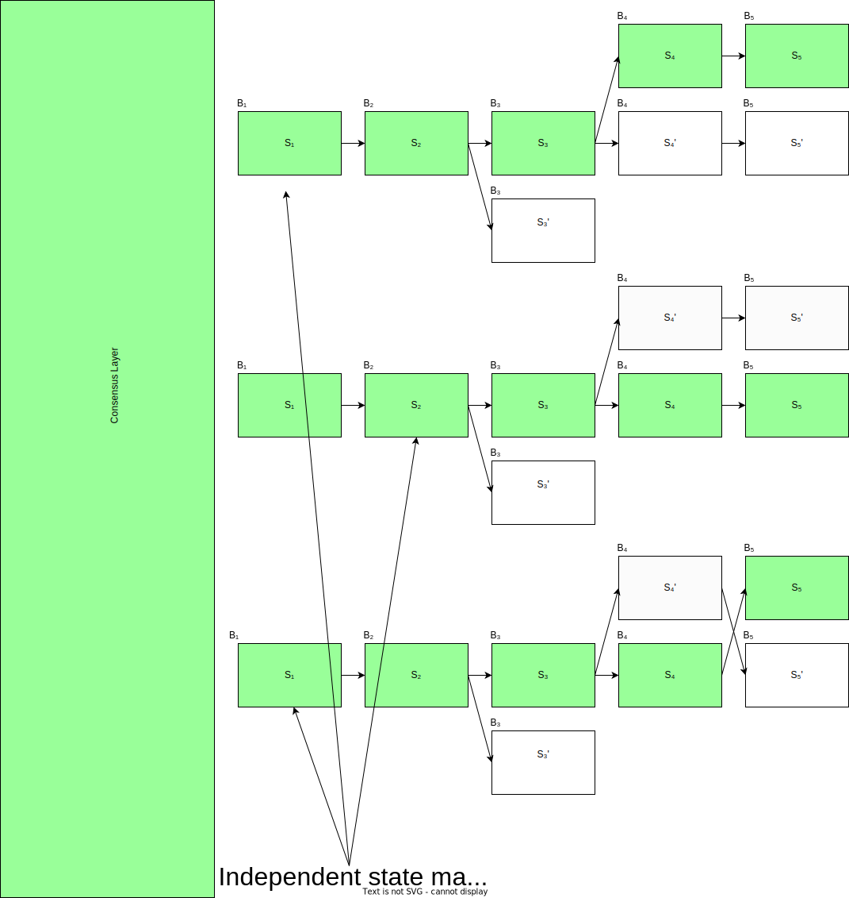

# Consensus Client

ISMP's messaging abstraction is built on top of the `ConsensusClient`. We refer to it as a consensus client because that is precisely what it should be: a client that observes a blockchain's consensus messages in order to determine what is canonical on the network.

Recall that the consensus mechanism is responsible for coming to a consensus about the canonical series of state transitions on the network. By leveraging state proofs, ISMP builds the request-response abstraction through knowledge of the canonical state transitions of a counterparty state machine.



This document formally defines the `ConsensusClient`, which serves as an oracle for the canonical state of a state machine, and the corresponding `ConsensusMessage`, which is used to advance the state of the consensus client.

## `ConsensusClient`

The consensus client is one half of a full blockchain client. It verifies only consensus proofs to advance its view of the blockchain network, where full nodes verify both consensus proofs and the state transition function of the network. This makes consensus clients suitable for resource-constrained environments like blockchains, enabling them to become interoperable with other blockchains in a trust-free manner.

The search for a mechanism by which a consensus client may observe and come to conclusions about the canonical state of another blockchain leads us to understand the concept of safety in distributed systems. We elaborate further on this in our research article on consensus proofs $^{[1]}$. In summary, we show that safety in on-chain consensus clients will require the use of a challenge window, even after consensus proof verification. This allows us to detect potential Byzantine behavior that may arise without the challenge window in place.

```rust
/// We define the consensus client as a module that handles logic for consensus & fraud proof verification,
pub trait ConsensusClient {
    /// Verify the associated consensus proof, using the trusted consensus state.
    fn verify_consensus(
        &self,
        host: &dyn IsmpHost,
        trusted_consensus_state: Vec<u8>,
        proof: Vec<u8>,
    ) -> Result<(Vec<u8>, HashMap<StateMachineId, StateMachineHeight>), Error>;

    /// Given two distinct consensus proofs, verify that they're both valid and represent conflicting views of the network.
    /// returns Ok(()) if they're both valid.
    fn verify_fraud_proof(
        &self,
        host: &dyn IsmpHost,
        trusted_consensus_state: Vec<u8>,
        proof_1: Vec<u8>,
        proof_2: Vec<u8>,
    ) -> Result<(), Error>;

    /// Return the unbonding period (i.e the time it takes for a validator's deposit to be unstaked from the network)
    fn unbonding_period(&self) -> Duration;

	/// Return an implementation of a [`StateMachineClient`] for the given state mahcine identifier. Return an error if the identifier is unknown.
	fn state_machine(&self, state_machine_id: StateMachineId) -> Result<Box<dyn StateMachineClient>, Error>;
}
```

The `verify_consensus` client decodes the provided consensus state bytes and proof according to its internal algorithm. If the verification is successful, it updates the trusted consensus state, returns it alongside any new state transitions finalized by the consensus proof. These new state transitions are kept in a pending state that extends for the configured `challenge_period` on the `IsmpHost`.

The Ismp consensus handler emits a `ChallengePeriodStarted` event to notify honest network participants to check if these pending state transitions describe valid transitions on the counterparty network. If not, they can submit a fraud proof in the form of consensus proofs for two distinct state transitions valid for the consensus client's verification algorithm. The `verify_fraud_proof` method allows verifying the validity of such fraud proof. If the `challenge_period` elapses without any fraud proofs being presented, we can safely conclude that the provided state transitions are indeed canonical.

To mitigate long fork attacks, we keep track of the timestamp at which a consensus client was successfully updated. The next time a consensus client receives a new update, we check that the difference between the current time and the last time the consensus client was updated does not exceed the client's unbonding period. In effect, this mitigates any potential long fork attacks that may arise due to a loss of liveness of consensus clients.

Now that we have a way to verify the consensus proofs of a blockchain in a fully byzantine fault tolerant manner. We might like to read the state of the blockchain. This allows us to process any outgoing requests addressed to us stored in the state trie of the blockchain. In order to read the state of the blockchain we’ll make use of state proofs. Different blockchains may different kinds of state tries. Merkle-patricia, IAVL, verkle tries, binary merkle trees, whatever the case may be, it is also the responsibility of the consensus client to provide the ISMP framework with an implementation of the `StateMachineClient`.

## `StateMachineClient`

The state machine client is an abstraction over the state proof scheme for a given state machine. ISMP permits a consensus client to have as many state machines as possible, and it allows these different state machines to leverage different state proof schemes. With this abstraction in place, ISMP is future-proofed and can work for both monolithic and modular blockchain architectures such as Polkadot, Ethereum, Celestia etc. 



The `StateMachineClient` is defined as follows:

```rust
/// A state machine client. An abstraction for the mechanism of state proof verification for state machines.
trait StateMachineClient {
	/// Verify the membership proof of a batch of requests/responses.
    fn verify_membership(
        &self,
        host: &dyn IsmpHost,
        item: RequestResponse,
        root: StateCommitment,
        proof: &Proof,
    ) -> Result<(), Error>;

    /// Transform the requests/responses into their equivalent key in the state trie.
    fn state_trie_key(&self, request: Vec<Request>) -> Vec<Vec<u8>>;

    /// Verify the state of proof of some arbitrary data. Should return the verified data
    fn verify_state_proof(
        &self,
        host: &dyn IsmpHost,
        keys: Vec<Vec<u8>>,
        root: StateCommitment,
        proof: &Proof,
    ) -> Result<HashMap<Vec<u8>, Option<Vec<u8>>>, Error>;
}
```

The `verify_membership` function allows for verifying the membership proofs of outgoing `Requests` or `Responses` that are stored in the state trie of the counterparty blockchain. We separate the verification of requests/response membership from state proof verification because, for some state machines, it may be possible to maintain the request/response in a cheaper tree structure overlaid on top of the state trie, such as a Merkle mountain range. In the future, it may even be possible to leverage Verkle trie overlays. This decoupling enables the use of fast and inexpensive verification algorithms for requests/responses in cases where state proof verification may be too costly.

State proof verification is only used in request timeouts and response verificaton for GET requests. In the case of request timeouts, the state machine client should describe a path to where request commitments are stored in the state trie using the `state_trie_key` method. So that their absence may be confirmed using the `verify_state_proof` method. The `verify_state_proof` method performs state proof verification given a set of trie keys. These trie keys may or may not exist in the trie and such a `None` variant can be used to signify non-membership for the given key.

### References

$^{[1]}$ [Consensus Proofs, Polytope Labs Research](https://research.polytope.technology/consensus-proofs)