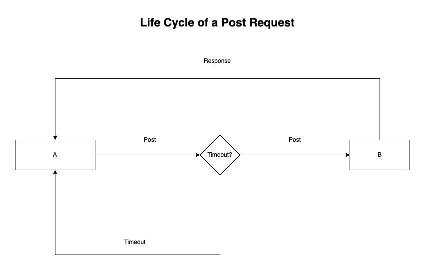
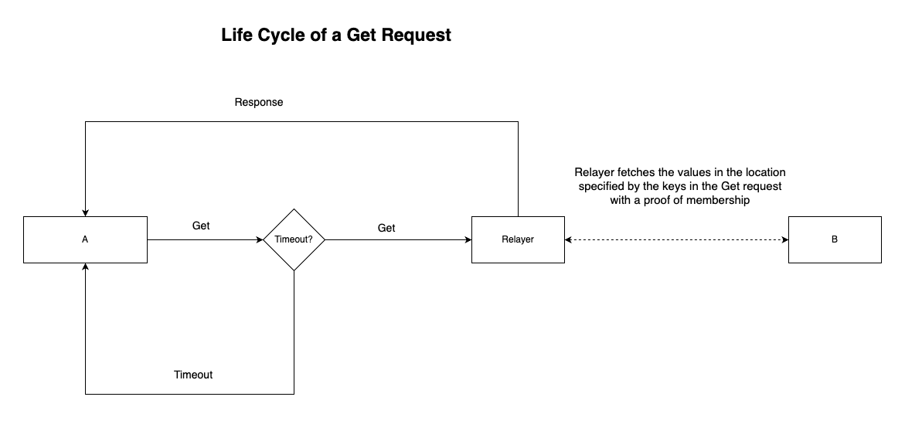
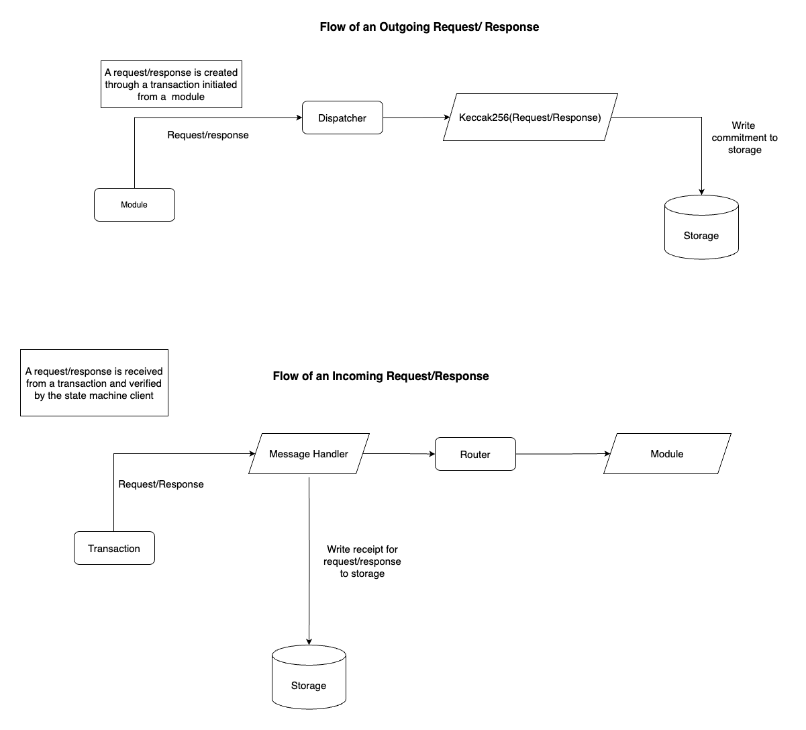

# Path of a request and response

At it’s core ISMP is a request response protocol bearing some similarities with HTTP, this means that an actor makes a
request from a state machine to be delivered to a counterparty state machine,  
then the counterparty creates a response to be forwarded back to the source after the request is processed.

An ISMP request can either be POST or GET similar to what is obtainable in HTTP.

```rust
enum Request {
    Post {
        /// The source state machine of this request.
        source_chain: StateMachine,
        /// The destination state machine of this request.
        dest_chain: StateMachine,
        /// The nonce of this request on the source chain
        nonce: u64,
        /// Module or contract Id of the sending module
        from: Vec<u8>,
        /// Module or contract Id of the receiving module
        to: Vec<u8>,
        /// Timestamp which this request expires in seconds.
        timeout_timestamp: u64,
        /// Encoded Request.
        data: Vec<u8>,
    },
    Get {
        /// The source state machine of this request.
        source_chain: StateMachine,
        /// The destination state machine of this request.
        dest_chain: StateMachine,
        /// The nonce of this request on the source chain
        nonce: u64,
        /// Module or contract Id of the sending module
        from: Vec<u8>,
        /// Storage keys that this request is interested in.
        keys: Vec<Vec<u8>>,
        /// Height at which to read the state machine.
        height: u64,
        /// Timestamp which this request expires in seconds
        timeout_timestamp: u64,
    }
}
```

A post request is an intent to execute some program on the counterparty state machine, it carries a payload, some opaque
bytes of to be delivered to the destination program on the counterparty state machine.

A GET request is an intent to fetch values for some keys in the database of the counterparty state machine.

While a POST request needs to be delivered to the counterparty for processing, a GET request is processed offchain by a
relayer.

### Life Cycle of a Request and Response

A request is created and dispatched by the `IsmpDispatch::dispatch_request`, a commitment of that
request which is a keccak256 hash of the request is inserted into the state trie, and a `Request` event is emitted, this
event informs any party that wishes to relay the requests to be aware of the existence of a new request.

A `RequestMessage` that contains the request alongside a proof of membership is then submitted to the counterparty
chain, after verifying this proof, a receipt for the request is committed to storage, the destination
module or contract can create a response synchronously or asynchronously, whenever this response is available it would
be relayed back to the source chain.




A response to a post request is created and dispatched by the `IsmpDispatch::dispatch_response`, a
commitment of that response which is a keccak256 hash of the response is inserted into the state trie, and a `Response`
event is emitted, this event informs any party that wishes to relay the responses to be aware of the existence of a new
response.

A `ResponseMessage` that contains the response alongside a proof of membership is then submitted to the counterparty
chain, after verifying this proof, a receipt for the response is committed to storage, the receipt is used to prevent
processing duplicate responses.

### Timeouts

Both Post and Get requests have a timeout, a Post request timeout is evaluated based on the timestamp of the destination
chain, this means that post requests cannot time out if the destination chain does not progress, using the destination
chain timestamp instead of the source chain’s timestamp prevents situations where a bad actor could submit a timeout for
a request that was already successfully executed on the destination. Timeout messages are accompanied by a proof of
non-membership.

Timeouts for Get requests are evaluated relative to the timestamp of the sending chain, the timestamp represents the
time on the sending chain after which responses to a Get request will be rejected.

### Responses

There are two kind of responses in ISMP, the response to a post request contains some opaque bytes that would be decoded
by the destination module on the receiving chain.

The response to a get request is a state proof for the requested keys, the values for each key would be extracted from
the proof.

### How requests and responses flow in storage

The protocol requires that a commitment(a keccak256 hash) for outgoing requests and responses be committed into the
state trie by the router.

For incoming requests, a receipt is stored for the request in storage, this helps prevent processing duplicate
requests, it’s also necessary for generating non membership proofs for request timeouts.



### Commitments

Commitments to storage are the means through which state machine clients verify the state of a counterparty state
machine.  
In ISMP it is required that a state machine commits a cryptographic hash of either a request or response to it's state
trie.
Hashing requests and responses is described in the functions below:

```rust
/// Return the keccak256 hash of a request
pub fn hash_request<H: IsmpHost>(req: &Request) -> H256 {
    match req {
        Request::Post(post) => {
            let mut buf = Vec::new();

            let source_chain = post.source_chain.to_string();
            let dest_chain = post.dest_chain.to_string();
            let nonce = post.nonce.to_be_bytes();
            let timestamp = post.timeout_timestamp.to_be_bytes();
            buf.extend_from_slice(source_chain.as_bytes());
            buf.extend_from_slice(dest_chain.as_bytes());
            buf.extend_from_slice(&nonce);
            buf.extend_from_slice(&timestamp);
            buf.extend_from_slice(&post.from);
            buf.extend_from_slice(&post.to);
            buf.extend_from_slice(&post.data);
            H::keccak256(&buf[..])
        }
        Request::Get(get) => {
            let mut buf = Vec::new();

            let source_chain = get.source_chain.to_string();
            let dest_chain = get.dest_chain.to_string();
            let nonce = get.nonce.to_be_bytes();
            let height = get.height.to_be_bytes();
            let timestamp = get.timeout_timestamp.to_be_bytes();
            buf.extend_from_slice(source_chain.as_bytes());
            buf.extend_from_slice(dest_chain.as_bytes());
            buf.extend_from_slice(&nonce);
            buf.extend_from_slice(&height);
            buf.extend_from_slice(&timestamp);
            buf.extend_from_slice(&get.from);
            buf.extend_from_slice(&get.keys.encode());
            H::keccak256(&buf[..])
        }
    }
}

/// Return the keccak256 of a response
pub fn hash_response<H: IsmpHost>(res: &Response) -> H256 {
    let (req, response) = match res {
        Response::Post { ref post, response } => (post, response),
        // Responses to get messages are never hashed
        _ => return Default::default(),
    };
    let mut buf = Vec::new();
    let source_chain = req.source_chain.to_string();
    let dest_chain = req.dest_chain.to_string();
    let nonce = req.nonce.to_be_bytes();
    let timestamp = req.timeout_timestamp.to_be_bytes();
    buf.extend_from_slice(source_chain.as_bytes());
    buf.extend_from_slice(dest_chain.as_bytes());
    buf.extend_from_slice(&nonce);
    buf.extend_from_slice(&timestamp);
    buf.extend_from_slice(&req.data);
    buf.extend_from_slice(&req.from);
    buf.extend_from_slice(&req.to);
    buf.extend_from_slice(response);
    H::keccak256(&buf[..])
}
```
